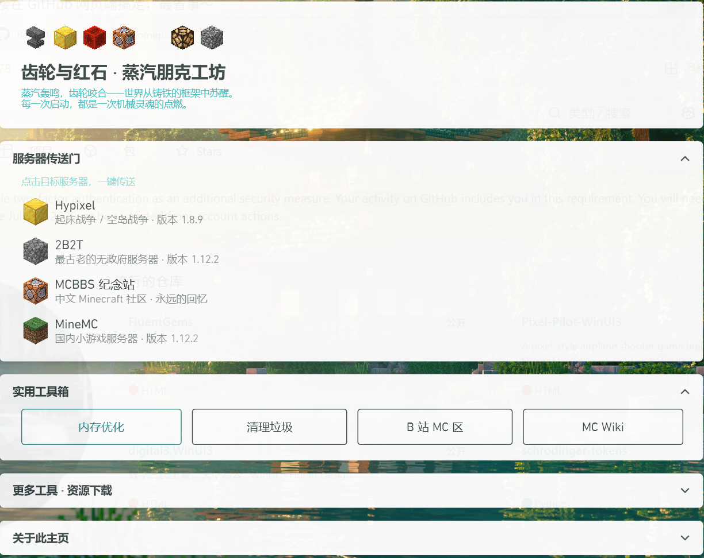

---
AIGC:
    Label: "1"
    ContentProducer: 001191440300708461136T1XGW3
    ProduceID: c592e66353ca9f5c930cfdc36e341482_8d4a5ef56ec411f1a0095254002afed2
    ReservedCode1: 1efPzTx6WFp5vD865fz8CYn2khQi5qZShttOh/wrS3qmwbXGk7Wp1MvDAh3tdzgHY/YyK+Ybw1tusgKJmfjxTgFIZjNpZszWTQ51Cj/HFn104S5v+eKjbgDWuE/kjYj38ws0FttiAlRyv8juYXpxsDLZsjOszuTZKgbpstSSGtOM1V882lYsEL545XI=
    ContentPropagator: 001191440300708461136T1XGW3
    PropagateID: c592e66353ca9f5c930cfdc36e341482_8d4a5ef56ec411f1a0095254002afed2
    ReservedCode2: 1efPzTx6WFp5vD865fz8CYn2khQi5qZShttOh/wrS3qmwbXGk7Wp1MvDAh3tdzgHY/YyK+Ybw1tusgKJmfjxTgFIZjNpZszWTQ51Cj/HFn104S5v+eKjbgDWuE/kjYj38ws0FttiAlRyv8juYXpxsDLZsjOszuTZKgbpstSSGtOM1V882lYsEL545XI=
---

# 齿轮与红石 · 蒸汽朋克工坊

PCL2 蒸汽朋克风格自定义主页 —— 齿轮轰鸣，红石闪烁，一台铸铁与代码交织的工业幻想。



## 卡片结构

| 卡片 | 状态 | 内容 |
|------|------|------|
| 齿轮与红石 | 常驻展开 | 铁砧 / 金块 / 红石 / 命令方块 / 钻石装饰行 + 主副标题 |
| 服务器传送门 | 默认展开 | Hypixel(1.8.9) / 2B2T(1.12.2) / MCBBS 纪念站 / MineMC |
| 实用工具箱 | 默认展开 | 内存优化 / 清理垃圾 / B 站 MC 区 / MC Wiki |
| 更多工具 · 资源下载 | 默认折叠 | 光影 / 模组 / 资源包 / CurseForge / 整合包 / PCL2 帮助 |
| 关于此主页 | 默认折叠 | 设计说明 + 修改提示 |

## 特色

- 配色使用 `{DynamicResource ColorBrush1~6}` 跟随 PCL 主题色动态切换
- 服务器入口集成一键启动（含正确版本号和服务器 IP）
- Grid 自适应布局，响应 PCL 窗口宽度变化
- 合理的信息密度：常用功能默认展开，低频内容默认折叠
- 内置 Minecraft 方块图标（铁砧、金块、红石块、命令方块、钻石等）作为装饰与列表项 Logo

## 安装

将 `Custom.xaml` 放入 PCL 启动器目录下的 `PCL` 文件夹中：

```
Plain Craft Launcher 2\PCL\Custom.xaml
```

重启 PCL 即可生效。如需恢复默认主页，直接删除 `Custom.xaml` 即可。

## 自定义

基于 PCL2 的自定义主页引擎（WPF / XAML），你可以自由修改 `Custom.xaml` 来定制内容。参考 PCL2 内置教程或 [PCL Wiki](https://github.com/Meloong-Git/PCL/wiki)。

## 许可

MIT License
*（内容由AI生成，仅供参考）*
